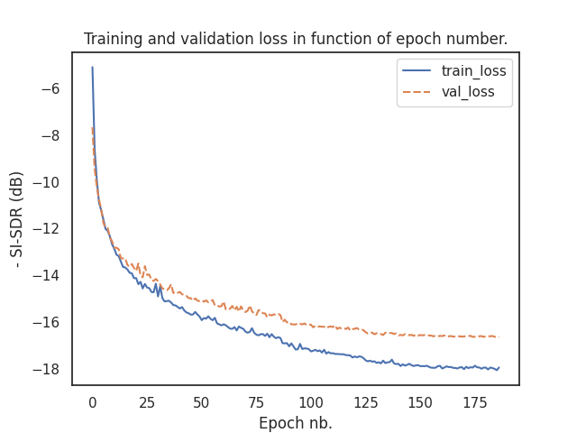

FAQ
===

My results are worse than the ones reported in the README, why?
---------------------------------------------------------------
There are few possibilities here:

1. Your data is wrong. We had this examples with wsj0-mix, WHAM etc..
where wv2 was used instead of wv1 to generate the data. This was fixed in
`#166 <https://github.com/asteroid-team/asteroid/pull/166>`_. Chances are there is a pretrained model available for the given dataset,
run the evaluation with it. If your results are different, it's a data problem.
Refs: `#164 <https://github.com/asteroid-team/asteroid/issues/164>`_,
`#165 <https://github.com/asteroid-team/asteroid/issues/165>`_ and `#188 <https://github.com/asteroid-team/asteroid/issues/188>`_.

2. You stopped training too early. We've seen this happen, specially with DPRNN.
Be sure that your training/validation losses are completely flat at the end of training.

|

3. If it's not both, there is a real bug and we're happy you caught it!
Please, open an issue with your torch/pytorch_lightning/asteroid versions to let us know.

How long does it take to train a model?
---------------------------------------
Need a log here.

Can I use the pretrained models for commercial purposes?
--------------------------------------------------------
Not always. See the note on pretrained models Licenses :ref:`Note about licenses`

Separated audio is really bad, what is happening?
-------------------------------------------------
There are several possible cause to this, a common one is clipping.

1. When training with scale invariant losses (e.g. SI-SNR) the audio output can be
unbounded. However, waveform values should be normalized to [-1, 1] range before saving,
otherwise they will be clipped.
See `Clipping on Wikipedia <https://en.wikipedia.org/wiki/Clipping_(audio)>`_ and
`issue #250 <https://github.com/asteroid-team/asteroid/issues/250>`_

2. As all supervised learning approaches, source separation can suffer from
generalization error when evaluated on unseen data. If your model works well
on data similar to your training data but doesn't work on real data, that's probably why.
More about this `on Wikipedia <https://en.wikipedia.org/wiki/Generalization_error>`_.
