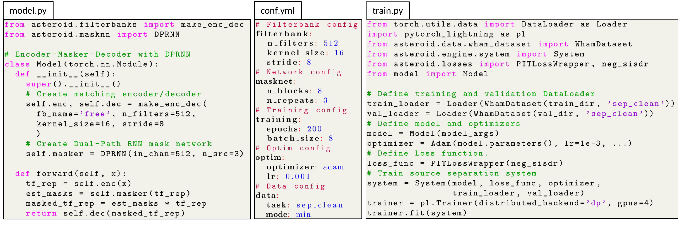

## What is a recipe?
A recipe is a set of scripts that use Asteroid to build a
source separation system.
Each directory corresponds to a dataset and each subdirectory
corresponds to a system build on this dataset.
You can start by reading [this recipe](wham/ConvTasNet) to
get familiar with them.

### How is it organized?
Most recipes are organized as follows. When you clone the repo,
`data`, `exp` and `logs` won't be there yet, it's normal.
```
├── data/
├── exp/
├── logs/
├── local/
│   ├── convert_sphere2wav.sh
│   ├── prepare_data.sh
│   ├── conf.yml
│   └── preprocess_wham.py
├── utils/
│   ├── parse_options.sh
│   └── prepare_python_env.sh
├── run.sh
├── train.py
├── model.py
└── eval.py
```
A small graph might help.


### How does it work?
Let's try to summarize how recipes work :

- There is a master file, `run.sh`,  from which all the steps are
ran (install dependencies, download data, create dataset, train a model
evaluate it and so on..). This recipe style is borrowed from
[Kaldi][kaldi] and [ESPnet][espnet].
  - You usually have to change some variables in the top of
  the file (comments are around it to help you) like data directory,
  python path etc..
  - This script is controlled by several arguments. Among them, `stage` controls
  from where do you start the script. You already generated the data? No need
  to do it again, set `stage=3`!
  - All steps until training are dataset-specific and the corresponding
  scripts are stored in `./local`

- The training and evaluation scripts are then called from `run.sh`
  - There is a script, `model.py`, where the model should be defined
  along with the `System` subclass used for training (if needed).
  - We wrap the model definition in one function (`make_model_and_optimizer`).
  The function receives a dictionary which is also saved in the
  experiment folder. This make checkpoint restoring easy without
  any additional constraints.
  - We also write a function to load the best model (`load_best_model`)
  after training. This is useful to load the model several
  time (evaluation, separation of new examples...).

- The arguments flow through bash/python/yaml in a specific way, which
was designed by us and suits our use-cases until now:
  - The very first step is the `local/conf.yml` file where is a
   hierarchical configuration file,
  - __On the python side__ : This file is parsed as a dictionary of
  dictionary in `training.py`. From this dict, we create an argument
  parser which can accept all the second-level keys from the
  dictionary (so second-level keys should be unique) as arguments
  and has the default values from the `conf.yml` file.
  - __On the bash side__: we also parse arguments from the command line
  (using `utils/parse_options.sh`). The arguments above the line
  `. utils/parse_options.sh`  can be parsed, the rest are fixed.
  Most arguments will be passed to the training script. Others control the
  data preparation, GPU usage etc...
  - In light of all this the config file should have sensible default
  values that shouldn't be modified by hand much. The quickly configurable part
  of the recipe are added to `run.sh` (you want to experiment with the batch
  size, add an argument in and pass it to python. If you want it fixed,
  no need to put it in bash, the conf.yml file keeps it for you.)
  This makes it possible to directly identify the important parts
  of the experiment, without reading lots of lines of
  argparser or bash arguments.

- Some more notes :
  - After the first execution, you can go and change `stage` in `run.sh` to
    avoid redoing all the steps everytime.
  - To use GPUs for training, run `run.sh --id 0,1` where `0` and `1` are the
  GPUs you want to use, training should automatically take advantage of both GPUs.
  - By default, a random id is generated for each run, you can also add a
  `tag` to name the experiments how you want. For example
  `run.sh --tag with_cool_loss` will save all results to
  `exp/train_{arch_name}_with_cool_loss`. You'll also find the
  corresponding log file in `logs/train_{arch_name}_with_cool_loss.log`.
  - Model loading methods suppose that the model architecture is the same
  as when training was performed. Be careful when you change it.

Again, you have a doubt, a question, a suggestion or a request,
[open an issue][issue] or [join the slack][slack], we'll be happy
to help you.

[kaldi]: https://github.com/kaldi-asr/kaldi
[espnet]: https://github.com/espnet/espnet
[issue]: https://github.com/mpariente/asteroid/issues/new
[slack]: https://join.slack.com/t/asteroid-dev/shared_invite/zt-cn9y85t3-QNHXKD1Et7qoyzu1Ji5bcA
